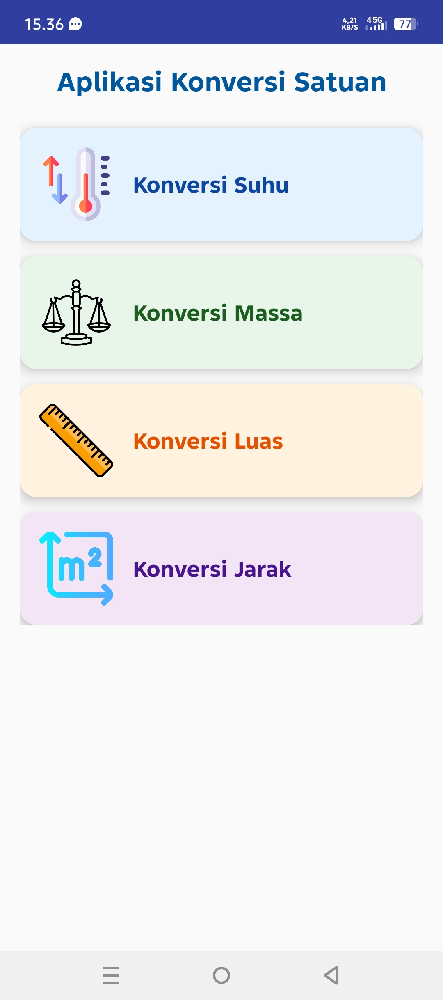
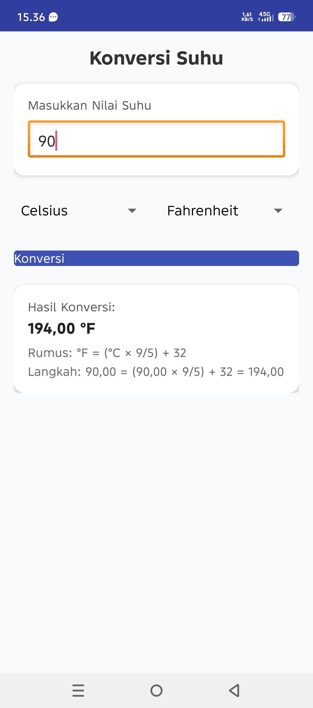
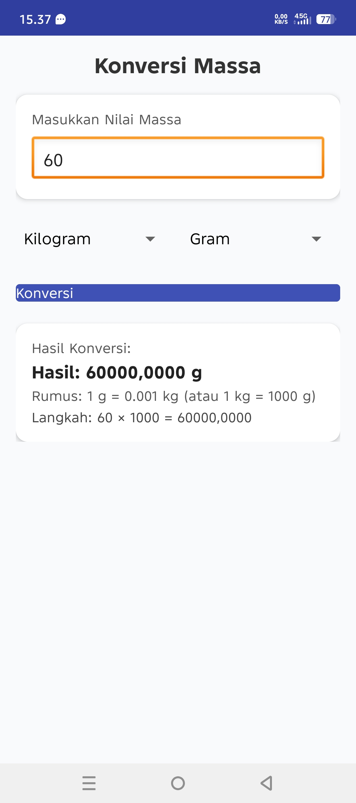
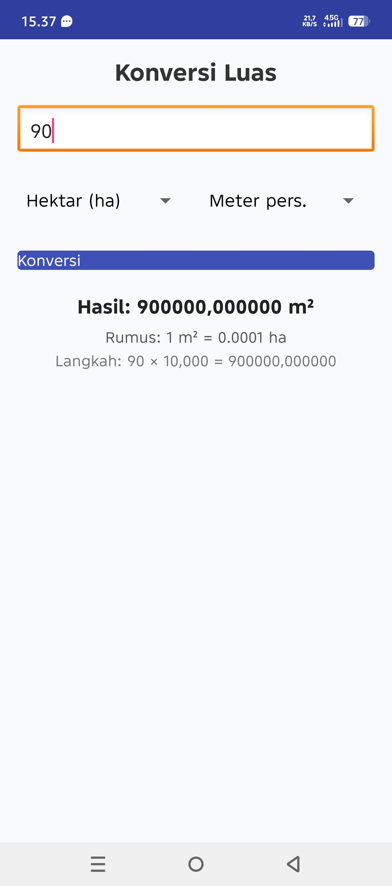
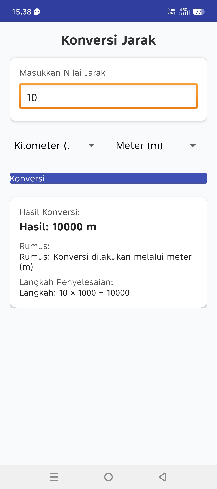

# 🌡️ Aplikasi Konversi Satuan

Aplikasi ini dibuat untuk melakukan berbagai konversi satuan, meliputi:
- 🔥 Konversi Suhu  
- ⚖️ Konversi Massa  
- 📐 Konversi Luas  
- 📏 Konversi Jarak  

---

## 📱 Tampilan Aplikasi

### 🧭 Navigasi Utama

### 🌡️ Konversi Suhu

### ⚖️ Konversi Massa

### 📐 Konversi Luas

### 📏 Konversi Jarak

---

## 👨‍💻 Pengembang
**Nama:** Muhammad Al Qadar Ramadhan  
**NIM:** 237200003  

---

## 🧾 Catatan
Project ini dikembangkan menggunakan **Android Studio** dengan bahasa pemrograman **Java**.  
Seluruh tampilan dan fungsi dirancang untuk memudahkan pengguna dalam memahami konversi satuan secara interaktif.

